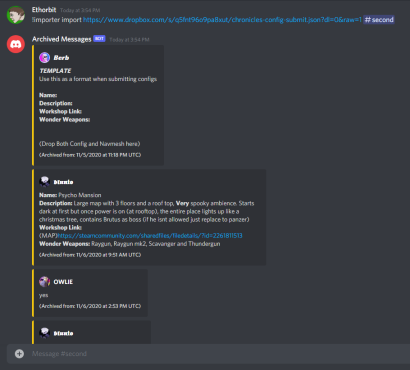

# Discord-Chat-Importer 

Discord-Chat-Importer allows you to import Discord channels and chats (exported from [DiscordChatExporter](https://github.com/Tyrrrz/DiscordChatExporter)) across Discord servers.

### [Tutorial](https://github.com/Ethorbit/Discord-Chat-Importer/wiki/Tutorial) | [Commands](https://github.com/Ethorbit/Discord-Chat-Importer/wiki/Commands)

